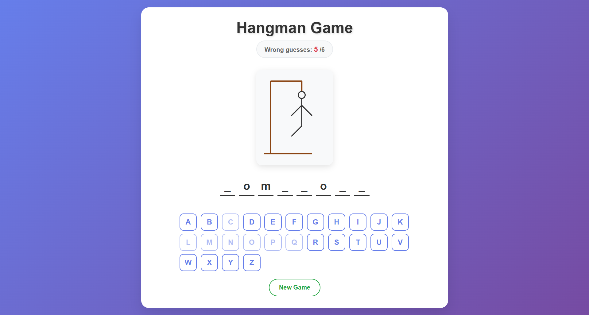
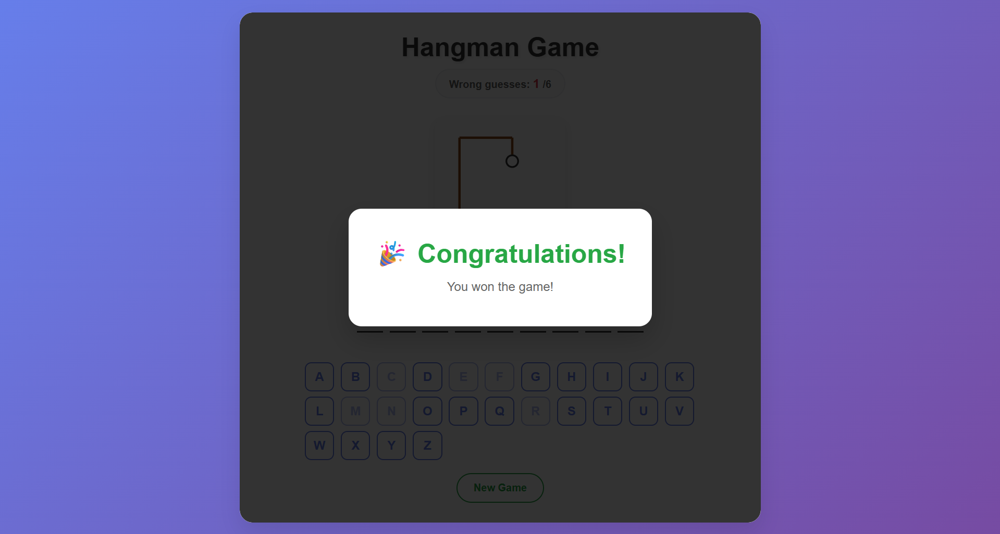
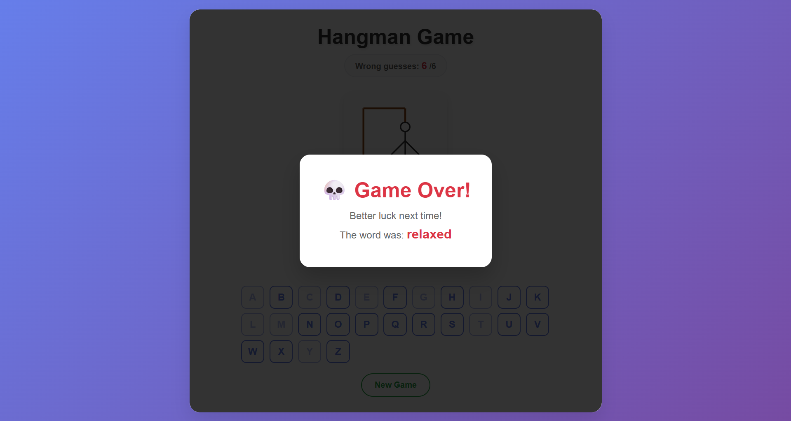

# Animated Hangman Game

A visually polished Hangman game built with HTML, CSS, and JavaScript.

This project features an interactive word guessing experience with animated UI feedback, responsive letter states, hangman part reveals, and win/lose game overlays.

---

# Project Overview

This is a browser-based Hangman game where the player guesses letters to reveal a hidden word.

The project focuses on:

- DOM manipulation with JavaScript
- interactive game state handling
- animated visual feedback
- clean and modern CSS styling

The game selects a random word from a predefined word list and updates the interface dynamically based on correct and incorrect guesses.

---

## Preview

### Game Screen


### Win Screen


### Lose Screen



---

# Features

- Random word selection
- Interactive alphabet buttons
- Correct and incorrect guess handling
- Animated letter reveal effects
- Progressive hangman drawing
- Win state overlay
- Lose state overlay
- New game button for restarting the game
- Styled UI with custom CSS animations

---

# Game Logic

The game works as follows:

1. A random word is selected from the word list
2. The word is initially displayed as hidden underscores
3. The player clicks letters to make guesses
4. Correct guesses reveal matching letters
5. Incorrect guesses increase the wrong guess counter and reveal hangman parts
6. The game ends when:
   - all letters are guessed correctly, or
   - the player reaches the maximum number of wrong guesses

---

# Technologies Used

- HTML5
- CSS3
- JavaScript (Vanilla JS)

---

# File Structure

```
animated-hangman-game/
├── index.html
├── styles.css
├── index.js
├── words.en.js
├── assets/
│   ├── preview.png
│   ├── win-screen.png
│   └── lose-screen.png
├── README.md
├── .gitignore
└── LICENSE
```

---

# JavaScript Highlights

This project includes:

* random word generation from a word list
* dynamic rendering of hidden letters
* event delegation for alphabet button clicks
* win/lose state handling via CSS classes
* hangman part reveal logic
* restart functionality using a new game button

---

# CSS Highlights

The interface includes custom styling and state-based classes such as:

* `.revealed`
* `.correct`
* `.incorrect`
* `.disabled`
* `.game-won`
* `.game-lost`
* `.correct-final`
* `.incorrect-final`

These classes are used to provide animated visual feedback and create a more polished game experience.

---

# How to Run

## Option 1: Open directly in browser

Simply open `index.html` in your browser.

## Option 2: Use VS Code Live Server

If you use Visual Studio Code, you can run the project with the Live Server extension for a better development experience.

---

# Possible Improvements

* Add difficulty levels
* Add category-based word lists
* Track score across multiple rounds
* Add sound effects
* Make the layout fully mobile-optimized
* Add keyboard input support
* Add timer mode

---

# Author

Jafar Hasanli
Computer Science Student
Eötvös Loránd University (ELTE)
